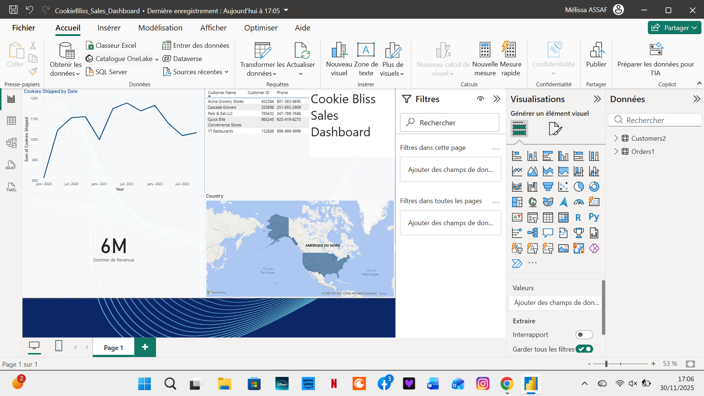

# Cookie Bliss Sales Dashboard

Interactive Power BI report built as part of a learning project.

## Objective

Analyze Cookie Bliss sales performance over time:
- Revenue trends
- Cookies shipped by date
- Customer overview
- Geographic distribution of sales

## Data

- **Customers** table: customer ID, name, location, contact details  
- **Orders** table: order ID, order date, cookies shipped, cost, revenue, customer ID

The data is sample data provided in the course *“Power BI for Beginners: Build your First Report”* (Coursera).

## Power BI Features Used

- Data modelling (relationships between Customers and Orders)
- DAX measures (Sum of Revenue, Sum of Cookies Shipped)
- Line charts, card visuals and map visual
- Filters and basic layout design

## How to open

1. Download the file: `CookieBliss_Sales_Dashboard.pbix`
2. Open it with **Power BI Desktop** (Windows)

## Preview

